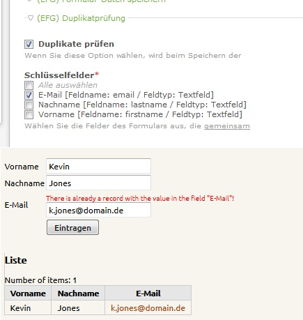

Contao Extension: EfgDuplicationChecker
=======================================

Adds duplication checking to the form generator when option `Store data in module "form data"` of [efg] is active.

Installation
------------

The extension is not published in contao extension repository. Install it manually.

Tracker
-------

https://github.com/cliffparnitzky/EfgDuplicationChecker/issues

Compatibility
-------------

- min. version: Contao 2.9.5
- max. version: Contao 2.11.x

Dependency
----------

- This extension is dependent on the following extensions: [[efg]](http://contao.org/de/extension-list/view/efg.de.html) (max. version: 1.16.4)

Screenshots
-----------

